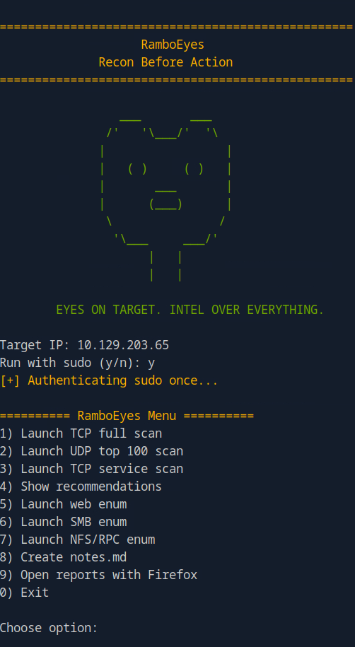

# RamboEyes

Recon Before Action

<p align="center">
  
</p>

RamboEyes is a Bash-based reconnaissance helper for HTB/CPTS-style labs.

## Features

- TCP full port scan
- Fast UDP top 100 scan
- TCP service scan
- Web enumeration
- SMB enumeration
- NFS/RPC enumeration
- HTML report generation
- Port-based recommendations
- Separate themed terminals

## Requirements

- nmap
- xsltproc
- firefox
- xfce4-terminal or gnome-terminal
- whatweb
- nikto
- gobuster
- smbclient
- enum4linux

## Usage

```bash
chmod +x ramboeyes.sh
./ramboeyes.sh

Disclaimer
Use only on systems you own or are authorized to test.
